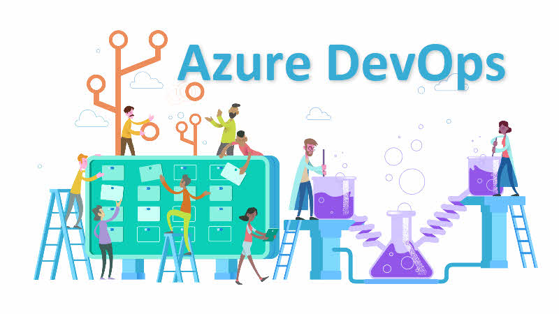
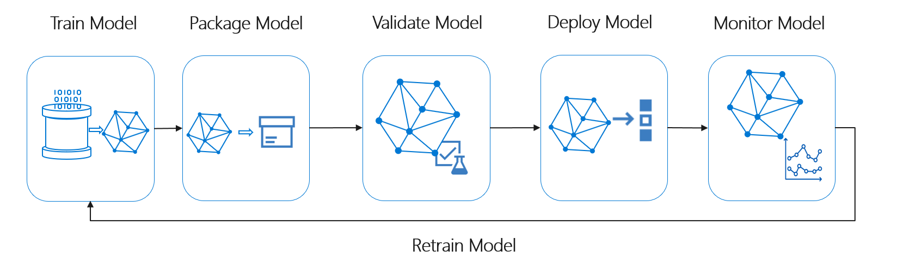
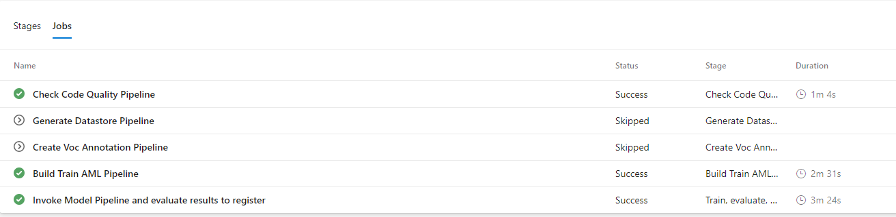
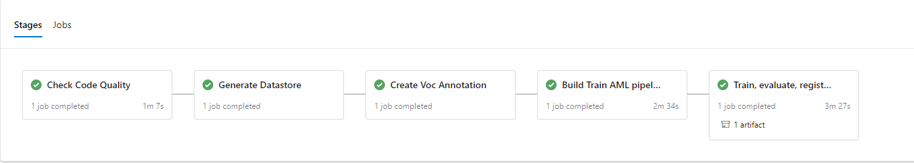

# MLOps using Azure ML Services, Azure DevOps and IoT Modules - Helmet Detection with YoloV3 
## Introduction
The objective is to develop two proofs of concept that allow the use of Artificial Intelligence for the detection of PPE and number of workers in a given area to be validated both at a technical and business level. 

### People detection
The objetive of this scenario is to detect and count the number of people in a given area. It is an essential and significant task in any intelligent video surveillance system.

A README with more information on how this model will work and the investigation done for this module is being created.

### PPE detection
The objetive of this scenario is to detect personal protective equipment (PPE), such as helmets and caps. Thanks to this, accidents can be avoided and it can be checked if the security measures are met sending an alert in case it is not.


***

## Project structure

```
.
├── .pipelines                          # Continuous integration 
├── code                                # Source directory
├── docs                                # Docs and readme info
├── environment_setup                        
|── .gitignore
├── README.md   

```

## Prerequisites
- Active Azure subscription
- At least contributor access to Azure subscription
- Permissions Azure DevOps project, at least as contributor.
- Conda set up

***

## Virtual environment
To create the virual environment, we need to have anaconda installed in our computer. It can be downloaded in this [link](https://www.anaconda.com/download/).

For this project there will be two virtual environments. One, with all the packages related to the person module and another one, with the packages related to the PPE module.

To create the virtual environment the _requirements.txt_ file will be used. It containts all the dependencies required.

To create the environment, first you will need to create a conda environment:

Go to `epis\code\ppe\experiment\ml_service\pipelines\environment_ppe.yml`

`conda create --name <environment_name>`

Once the environment is created, to activate it:

`activate <environment-name>`

To deactivate the environment:

`deactivate <environment-name>`

### PPE module



## Pipelines
#### CI-PPE Module
This pipeline will update the docker image when any change is done to the Dockerfile and it will create an artifact with the IoT manifest. Where the ACR password, username and the Docer image name will be automatically filled with the values specified in the DevOps Library.

### CI - Infrastructure As Code
This pipeline will automatically create the resource group and the services needed in the subscription that will be specified in the *cloud_environment.json* file located in the *environment_setup/arm_templates* folder.

This pipeline will be automatically triggered when a change is done in the ARM template.

### CI - MLOps
MLOps will help you to understand how to build the Continuous Integration and Continuous Delivery pipeline for a ML/AI project. We will be using the Azure DevOps Project for build and release/deployment pipelines along with Azure ML services for model retraining pipeline, model management and operationalization.



This template contains code and pipeline definition for a machine learning project demonstrating how to automate an end to end ML/AI workflow. The build pipelines include DevOps tasks for check quality, generate/update datstore in our AML resource, generate Pascal VOC annotation, model training on different compute targets, model version management, model evaluation/model selection, model deployment embedded on IoT Module (Edge).

### Continuous Integration
There will be two continuouos integration (CI) pipelines. One, where all the infraestructure will be set up (CI-IaC) and other more specific to AI projects (CI-MLOps)

Any of this pipelines can be manually triggered. To do so, you should go to the Azure DevOps portal, click on Pipelines>Pipelines, select the desired pipeline and click on run pipeline.

During the continuous integration an artifact is created that will leater be released during the continuous deployment.




### References

- [Azure Machine Learning(Azure ML) Service Workspace](https://docs.microsoft.com/en-us/azure/machine-learning/service/overview-what-is-azure-ml)
- [Azure ML CLI](https://docs.microsoft.com/en-us/azure/machine-learning/service/reference-azure-machine-learning-cli)
- [Azure ML Samples](https://docs.microsoft.com/en-us/azure/machine-learning/service/samples-notebooks)
- [Azure ML Python SDK Quickstart](https://docs.microsoft.com/en-us/azure/machine-learning/service/quickstart-create-workspace-with-python)
- [Azure DevOps](https://docs.microsoft.com/en-us/azure/devops/?view=vsts)
