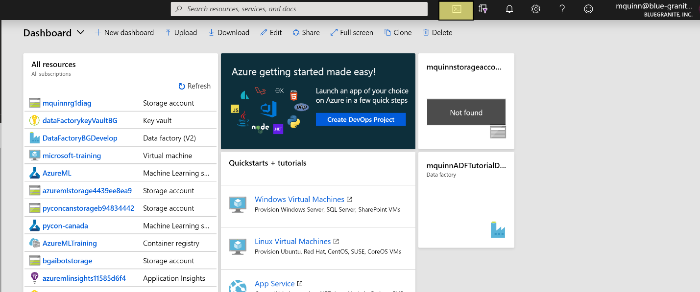
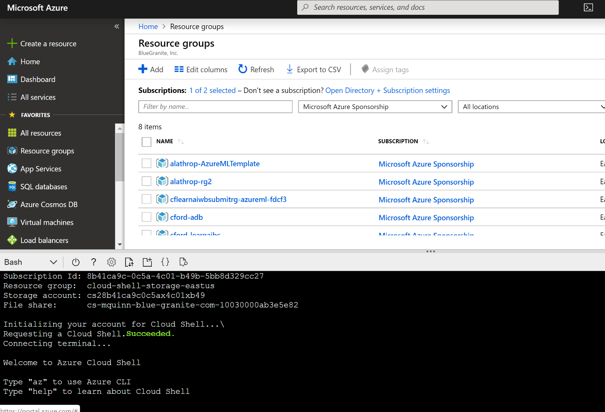
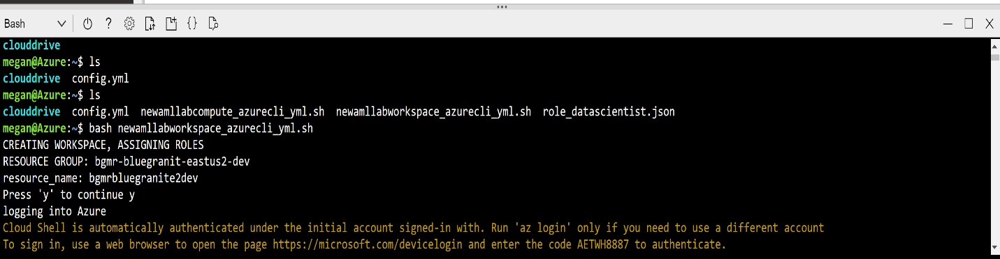
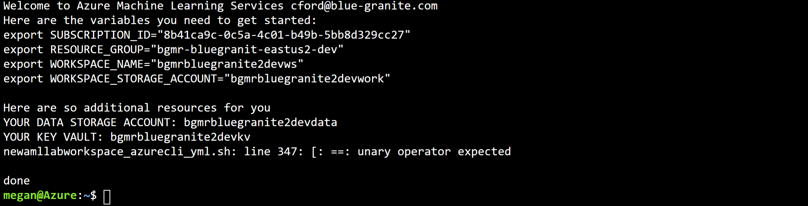
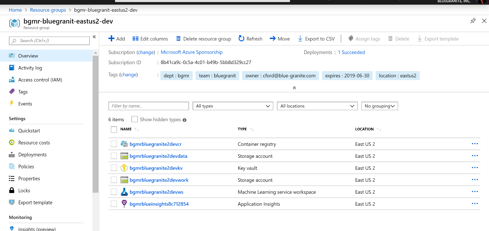
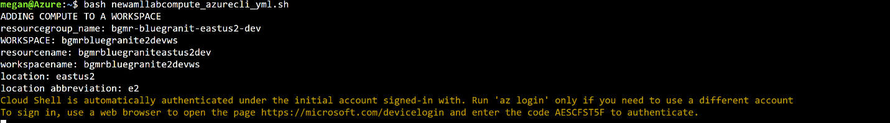
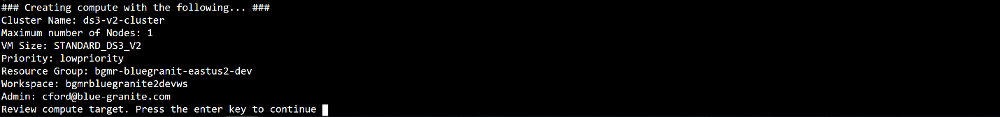
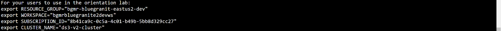

# How to automate Azure Machine Learning service workspace creation

Learn how to automate the creation of secure, manageable, Azure Machine Learning workspaces.

A default configration for an Azure Machine Learning service workspace may not be suitable for your company's needs. You may want to control and automate access using role-based access control (RBAC) or pre-allocate compute targets. This article and the associated scripts provide a framework for automating the following actions:

* __Create AzureML workspaces__ with custom roles, security groups, and optionally create Azure Data Lake Store as a data store.
* __Pre-configure and create compute targets__. For example, setting the scaling, priority, and VM size for Azure Kubernets Service clusters used by the workspace.
* __Assign users to Team Lead and Data Scientist roles.__ 

> [!TIP]
> The scripts for this article can be downloaded from [some github repo]().

## Prerequisites

* Users of this guide will already have an assigned subscription ID and compute quota.

## Background and Purpose
* __An enterprise can have multiple organizations responsible for its own profit & loss.__ Each organization can have its own subscription to track its resource capacity utilization and billing. Awareness of workspace configuration within a subscription is helpful to monitor resource usage and control spend. 

* __Access management for cloud resources is a critical function for any organization using the cloud.__ [Role-based access control (RBAC)](https://docs.microsoft.com/en-us/azure/role-based-access-control/overview) helps you manage who has access to Azure resources, what they can do with those resources, and what areas they have access to. In an enterprise scenario for AML, we would like to manage which users can perform actions impacting cost, such as requesting resource quota and creating/modifying compute clusters. 

* __This document is meant to more clearly outline configuration options__ helpful for resource management and cost control that may not be apparent when using the default configuration through the Azure portal.

* __In this tutorial, Team Leaders are those who are assigned the role of Subscription and Workspace Owners. Custom roles of '*Team Lead*' and ‘*Data Scientist*’ will be created.__ Thus, we will have three RBAC roles in play for the AML service.  Owner  (built-in role) for the Team Lead persona, Reader (built-in role) for applications or those with read access only, and Data Scientist (custom role) for data scientist persona. Data scientists should be able to prepare data, build, train, deploy and inference models in the workspaces using clusters and other approved resources (such as compute quota) already setup by Team Leaders.

* __This guide will focus on access control for two roles: ‘*Team Lead*’ and ‘*Data Scientist*’.__

__'*Team Lead*' role:__

- create and manage access to resource groups and AzureML workspaces for data science teams

- create and allocate compute resources within quota (monitor and report)

- create and manage shared datastores for workspace artifacts and experiment data

- manage spend on compute resources by creating custom roles with access controls

- provide shared resource information (such as secure data stores) to team members

- provide AzureML training resources to team members

__'*Data Scientist*' role:__

- Use workspace to run machine learning experiments, especially at scale with remote compute resources

- Use dedicated and shared Azure data sources for collaborative model building

- Cannot request compute quota

- Cannot create or modify AzureML compute resources

- Cannot create support tickets

## Access the Azure Command Line Interface (CLI) in the Azure Portal and clone the file repository
The Azure CLI is a command-line tool providing a great experience for managing Azure resources. The CLI is designed to make scripting easy, query data, support long-running operations, and more.

Log into the Azure Portal and click on the cloud shell icon in the top right panel:

[Cloud Shell](https://docs.microsoft.com/en-us/azure/cloud-shell/persisting-shell-storage) machines are temporary and require an Azure File share to be mounted as `clouddrive`. On the first launch of Cloud Shell the following items are automatically created for this purpose. If prompted to create resources for file share enter yes.

## Setup Azure ML Workspace
The _workspace_ is the top-level resource for Azure Machine Learning service. For ideas on workspace organization see the following two links: [What is an Azure Machine Learning service workspace?](https://docs.microsoft.com/en-us/azure/machine-learning/service/concept-workspace) and [How Azure Machine Learning service works: Architecture and concepts](https://docs.microsoft.com/en-us/azure/machine-learning/service/concept-azure-machine-learning-architecture). A workspace provides a centralized place to work with the artifacts created while using Azure Machine Learning service. These artifacts include metrics and logs associated with a training run. This aids in determining the best model when testing multiple options. A workspace can be created in multiple ways including through a Resource Manager template, the Azure Portal, and Azure CLI.

For this setup, a template script `newamllabworkspace.sh` is provided in the script repository.

- This script provisions the following resources using parameters specified in the `config.yml` file (editing instructions to customize your workspace are shown [below](#workspace-parameters)):

| Resource            | Description                                                                                                                                                              |
| ------------------- | ------------------------------------------------------------------------------------------------------------------------------------------------------------------------ |
| Resource Group      | The top-level resource that provides a centralized location for all the resources                                                                                        |
| ML Workspace        | The service for Machine Learning in Azure, includesexperiment tracking, model management, operationalization, and more.                                                  |
| Storage Account     | Two accounts are created, `devdata` and `devwork`. The `devdata` is used to store data for analysis. The `devwork` is used to store any artifacts created from the runs. |
| Container Registry  | Used to build, store, and manage images for container deployments.                                                                                                       |
| Key Vault           | Used to encrypt and store authentication keys, storage account keys, and secrets                                                                                         |
| App Insights        | Used to monitor the live web application, including detecting anomalies and understanding user interaction.                                                              |
| Data Scientist Role | Can use the workspace and shared resources but cannot request compute quota, modify compute resources or create support tickets                                          |

- The '*Data Scientist*' and '*Team Lead*' roles are created as custom roles. Users can be [assigned to this role](https://docs.microsoft.com/en-us/azure/machine-learning/service/how-to-assign-roles) within the Azure Portal or using the `assignamlworkspaceroles.sh` (as shown in [step 4](#4-assigning-user-roles) below).

#### To Begin...

Clone the git directory in the Azure CLI use the following command:

`git clone --single-branch --branch colby https://github.com/BlueGranite/dogbreeds.git`

This workspace template script receives the required workspace creation and naming parameters such as subscription id, department, team, region, and admin from a configuration file. You will need to update the `config.yml` file with your own account information as follows:

- Open the `config.yml` in the CLI editor and update the values with your own subscription and naming information. This file, along with the other required template files, are located in the downloaded directory from above in *lab/admin*.
  - *Note*: To edit your `config.yml` file, you can use your favorite command line text editor such as `nano`. Use the command `nano config.yml`and the file will open in the text editior. Update the parameters to the desired values. Once you are finished editing, press `ctrl-x` to exit and then `y` to save.
  
  - ##### Workspace Parameters:
    
    | Parameter      | Description                                                                                                                                                                                                                                                                                              | Example                                          |
    |:--------------:|:--------------------------------------------------------------------------------------------------------------------------------------------------------------------------------------------------------------------------------------------------------------------------------------------------------:|:------------------------------------------------:|
    | subscription   | Your Azure subscription where the resources are to be created                                                                                                                                                                                                                                            | 8b41ca0c-0c5a-4c01-b49b-5bb8d329cc27             |
    | custom_name    | Give a custom name to the resources. Can be used to suppress Microsoft’s automatic, conventional naming scheme of concatenating the other parameters. This parameter is useful in ensuring multiple workspaces with common names are not trying to be created which would result in an error. (Optional) | myamlsresource                                   |
    | department     | 4 characters to specify the department name at your organization                                                                                                                                                                                                                                         | dpt2                                             |
    | team           | 10 characters to specify the team name at your organization                                                                                                                                                                                                                                              | myteam                                           |
    | region         | The region where the resources are to be created.                                                                                                                                                                                                                                                        | eastus2                                          |
    | region_abbv    | 2 characters abbreviation of the desired region                                                                                                                                                                                                                                                          | e2                                               |
    | environment    | 3 characters to specify the type of environment                                                                                                                                                                                                                                                          | select from `res`, `dev`, or `pro`               |
    | admin          | The admin Microsoft account that will be used to create the resources                                                                                                                                                                                                                                    | user@domain.com                                  |
    | security_group | Name of the security group on premises to map a group in Azure Active Directory (Optional)                                                                                                                                                                                                               | datasciencegroup                                 |
    | create_dls     | Should the script create an additional Azure Data Lake Store for housing large datasets?                                                                                                                                                                                                                 | `y` to create the data lake store or `n` to skip |
  
  - Compute Parameters:
    
    *Note:* Each of these parameters can either be a single value or a comma-separated list of values if you want to create multiple computes at once.
    
    | Parameter    | Description                                                                                                                                                  | Example                                                                       |
    |:------------:|:------------------------------------------------------------------------------------------------------------------------------------------------------------:|:-----------------------------------------------------------------------------:|
    | nodes        | List of maximum number of nodes to which each cluster will scale                                                                                             | 1, 2, 1                                                                       |
    | priority     | List of priority levels of the cluster resources                                                                                                             | lowpriority, dedicated, lowpriority (either `lowpriority` or `dedicated`) |
    | vm_sku       | List of VM SKUs from `az vm list-sizes --location,--output table` or from [this list](https://docs.microsoft.com/en-us/azure/virtual-machines/windows/sizes) | STANDARD_DS3_V2, STANDARD_D13_V2, STANDARD_NV6                                |
    | cluster_name | List of cluster names to be created, up to 16 characters each.                                                                                               | ds3-v2-cluster, ds13-v2-2ndclust, nv6-gpucluster                              |
  
  - Role Parameters:
    
    *Note:* Each of these parameters can either be a single value or a comma-separated list of values if you want to assign multiple users at once.
    
    | Parameter       | Description                                                | Example                         |
    | --------------- | ---------------------------------------------------------- | ------------------------------- |
    | team_leads      | List of accounts to be assigned to the Team Lead role      | admin1@site.com, user1@site.com |
    | data_scientists | List of accounts to be assigned to the Data Scientist role | user1@site.com, user2@site.com  |

Run the workspace creation script by using `bash newamllabworkspace.sh`. The script will automatically look for the `config.yml` file to read in your settings.

The user also has the option to specify a different YAML file for the script to use. Simply create your YAML file and pass the filename in as you call the script using `bash newamllabworkspace.sh <YOUR CONFIG FILENAME>.yml`. 

Enter ‘`y`’ to continue. A prompt will appear to follow the Microsoft link to login with the provided authentication code.

This will create the workspace along with the necessary resources.

By navigating to the specified subscription and resource group in the Azure portal window all the resources created can be viewed:

## Setup Compute Resources
A [compute target](https://docs.microsoft.com/en-us/azure/machine-learning/service/concept-compute-target) specifies the compute resource where a training script will be run. The target could either be on a local machine or cloud-based. Compute targets allow for an easy transition among environments without altering code.

Creating the right cluster definition is critical. We recommend setting the minimum number of nodes to 0 (the default) and idle seconds before scale down  to 120 (the default). These defaults are used in the provided example scripts. This ensures the compute cluster will automatically scale down during period of inactivity and not incur charges. Subscription Owner and Contributor, and Workspace Owner and Contributor can create and modify the cluster configuration. Please see [this reference](https://docs.microsoft.com/en-us/azure/machine-learning/service/how-to-set-up-training-targets) for more information on setting up compute clusters.

For this setup, a template script `newamllabcompute.sh` is provided in the script repository.

- This script creates one or more remote compute targets using parameters specified in the `config.yml` file (editing instructions to customize your compute targets are explained [above](#workspace-parameters)).

The parameters required for the compute script include:

- Maximum number of nodes

- Priority of the node: either lowpriority or dedicated

- VM SKU: Options for this parameter can be found using the command `az vm list-sizes --location <region> --output table`

- Cluster Name: Up to 16 characters allowed

*Note:* Multiple computes can be created by using comma-separated lists for each of these parameters.

Similarly, to the workspace script, these parameters can be customized in the `config.yml` file or your own YAML file.

To run the compute script, enter `bash newamllabcompute.sh` or `bash newamllabcompute.sh <YOUR CONFIG FILENAME>.yml` (if using a different YAML file from the `config.yml`). Again, follow the Microsoft hyperlink to the login page and enter the provided authentication code.

The compute parameters are displayed and pressing enter to verify the parameters are correct launches the creation of the compute target

Attributes and properties of the cluster can be viewed by navigating to the machine learning workspace and clicking on the Compute icon on the left side panel.

To create additional computes in the same workspace:

- Edit the `config.yml` and add your additional compute specifications to the parameter lists.

- The name of the new compute must be different from the existing computes

- In Azure CLI, re-run the command `bash newamllabcompute.sh` and the script will then create any computes that don't already exist.
  
  Note: The script will skip over any computes that already exist (based on cluster name).

## Assign Users to Roles
You may want to configure different user privileges across data stores using [role-based access control](https://docs.microsoft.com/en-us/azure/role-based-access-control/overview#how-rbac-works) (RBAC). For example, an administrator may want to control access to storage with personally identifiable information and allow access to only certain members or teams within a workspace. The _team lead_ and *data scientist* roles can be assigned using the `assignamlworkspaceroles.sh` script.

For this setup, a template script `assignamlworkspaceroles.sh` is provided in the script repository.

- This script assigns one or more users to either the *Team Lead* role or the *Data Scientist* role using parameters specified in the `config.yml` file (editing instructions to customize your compute targets are explained [above](#workspace-parameters)).

Role descriptions:
* __Team Lead role:__

  - create and manage access to resource groups and AzureML workspaces for data science teams

  - create and allocate compute resources within quota (monitor and report)

  - create and manage shared datastores for workspace artifacts and experiment data

  - manage spend on compute resources by creating custom roles with access controls

  - provide shared resource information (such as secure data stores) to team members

  - provide AzureML training resources to team members

* __Data Scientist role:__

  - Use workspace to run machine learning experiments, especially at scale with remote compute resources

  - Use dedicated and shared Azure data sources for collaborative model building

  - Cannot request compute quota

  - Cannot create or modify AzureML compute resources

  - Cannot create support tickets

As in creating multiple computes, in the `config.yml` file, list the accounts desired for each role in a comma-separated list. Then run in the Azure CLI:

`bash assignamlworkspaceroles.sh` or `bash assignamlworkspaceroles.sh <YOUR CONFIG FILENAME>.yml`

Currently, as mentioned above, the only roles assigned by the script are *Team Lead* and *Data Scientist*. In future installments, there will be two types of B.C. Administration Roles; one at the subscription level and one at the resource group level. The subscription-level admin role will have the ability to request and create more quota. The resource group-level admin role will not be able to increase quota but can create clusters.

## Next steps

This should contain a bulleted list of links to other articles/notebooks that are logical next steps after reading this document.

* [article name](link of article .md file or http path to notebook)
* [another link](link address)

# !!!!!!!!!!!!!!!!!!!!!!!!!!!!!!!!!!!!!!!!!!!!!!!!!!!!!!!!!
## Appendix (original content from Readme.md for reference)
### Scenarios:

An enterprise can have multiple organizations responsible for its own profit & loss. Each organization can have its own subscription to track its resource capacity utilization and billing. All Azure Machine Learning resources can be shared across a  subscription, but proper workspace configuration is required to monitor resource usage and control spend. For example, in Microsoft Research, there are multiple subscriptions, each representing subgroups within Microsoft responsible for resource capacity planning. The way resources are distributed and shared is differs by group. In one subscription, each resource group represents one team and there will be one workspace in that resource group for the entire team.

In another subscription, each workspace represents a specific type and quantity of GPU VM family with a limit on compute nodes. In this scenario, different users are  temporarily assigned to the resource groups based on their computing requirements. Access to the resource group and the workspace will change on a regular basis.

Enterprises often have a fixed budget for each fiscal time period. Thus, being able to control access impacting the spend and utilization of compute resources is important for enterprises. There are two activities that can cause the spend to go beyond the upper limit of the budget: requesting more quota for the AML service and creating clusters which do not auto scale.

Once a subscription is available, when adding an AML service, a quota request approval is required. The AML service comes with three built-in roles: Owner, Contributor and Reader. Subscription Owner and Contributor and Workspace Owner and Contributor can request quota change. Please see [this reference](https://docs.microsoft.com/en-us/azure/machine-learning/service/how-to-manage-quotas) for more information on managing quotas.

Creating the right cluster definition is critical. We recommend setting the minimum number of nodes to 0 (the default) and idle seconds before scale down  to 120 (the default).  The ensures the compute cluster will automatically scale down during period of inactivity and not incur charges. Subscription Owner and Contributor, and Workspace Owner and Contributor can create and modify the cluster configuration. Please see [this reference](https://docs.microsoft.com/en-us/azure/machine-learning/service/how-to-set-up-training-targets) for more information on setting up compute clusters.

Access management for cloud resources is a critical function for any organization that is using the cloud. [Role-based access control (RBAC)](https://docs.microsoft.com/en-us/azure/role-based-access-control/overview) helps you manage who has access to Azure resources, what they can do with those resources, and what areas they have access to. In an enterprise scenario for AML, we would like to manage which users can perform actions such as requesting resource quota and creating/modifying compute clusters. Data scientists should be able to prepare data, build, train, deploy and inference models in the workspaces within the approved resources and using clusters already setup by Team Leaders.

In this tutorial, Team Leaders are those who are assigned the role of Subscription and Workspace Owners. A custom role of ‘Data Scientist’ will be created. Thus, we will have three RBAC roles in play for the AML service.  Owner  (built-in role) for the Team Lead persona, Reader (built-in role) for applications or those with read access only, and Data Scientist (custom role) for data scientist persona.

#### This tutorial will cover automation and management related to:

- Creating custom user roles,  such as a data scientist, with defined permissions related to compute resources

- Creating resource groups for AzureML-related resources

- Creating AzureML workspaces

- Assigning user permissions at various scopes, such as subscription or workspace

__Important concepts:__

- [AzureML workspaces](https://docs.microsoft.com/en-us/azure/machine-learning/service/concept-workspace) allow collaboration through data set and model registration

- Understand user roles: owner, reader, and the custom role of data scientist

- How to enforce compute resource quota across team members
