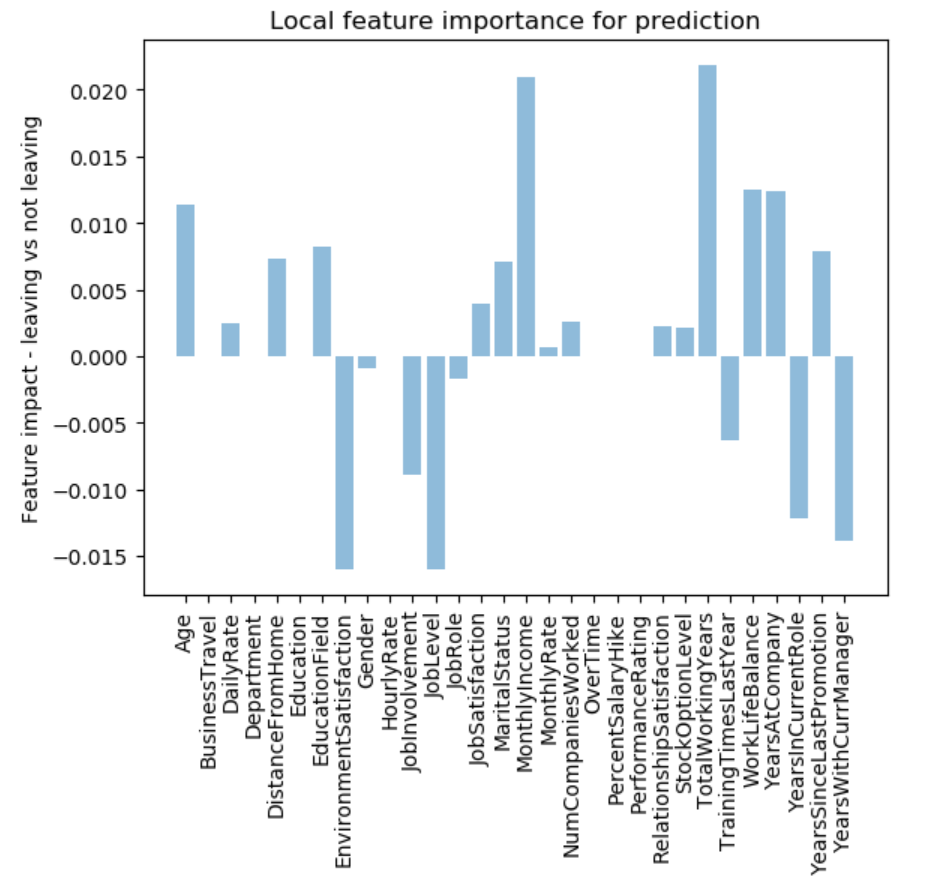

# Train & deploy a model with a built in explainer to Azure ML
This example is going to use an employee attrition dataset to help us train a model to determine the likelihood of an employee leaving a company. Beyond this, we will generate an Explanations Dashboard which helps indicate the local and global feature importance with respect to the all-up prediction.

# How it works

## Train model

## Create explainer from trained model

## Deploy model and explainer together

## Query deployed service to get prediction and explanation
```
import requests
import json

headers = {'Content-Type':'application/json'}

# send request to service
resp = requests.post(service.scoring_uri, sample, headers=headers)
print("prediction:", resp.text)
result = json.loads(resp.text)
```

This will return you a JSON file which contains the prediction (attrition / no attrition) and the weighted feature importance score.

