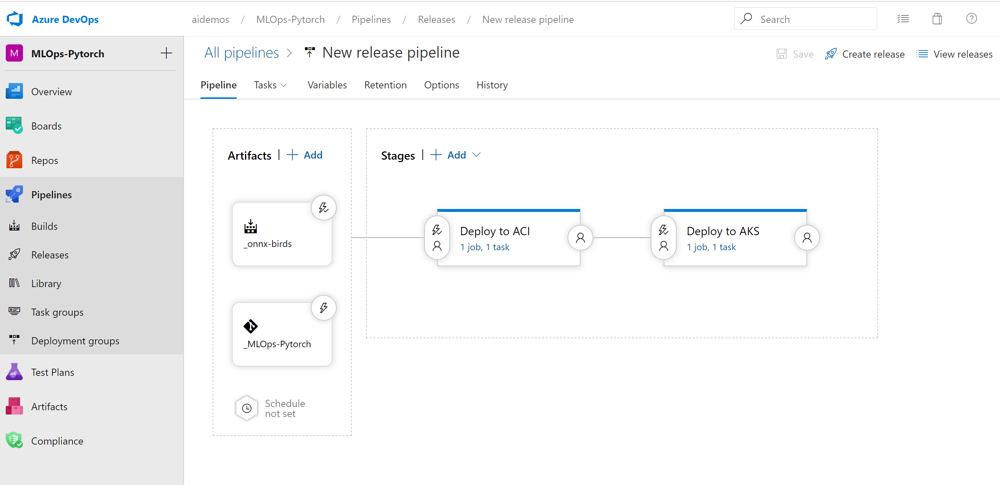
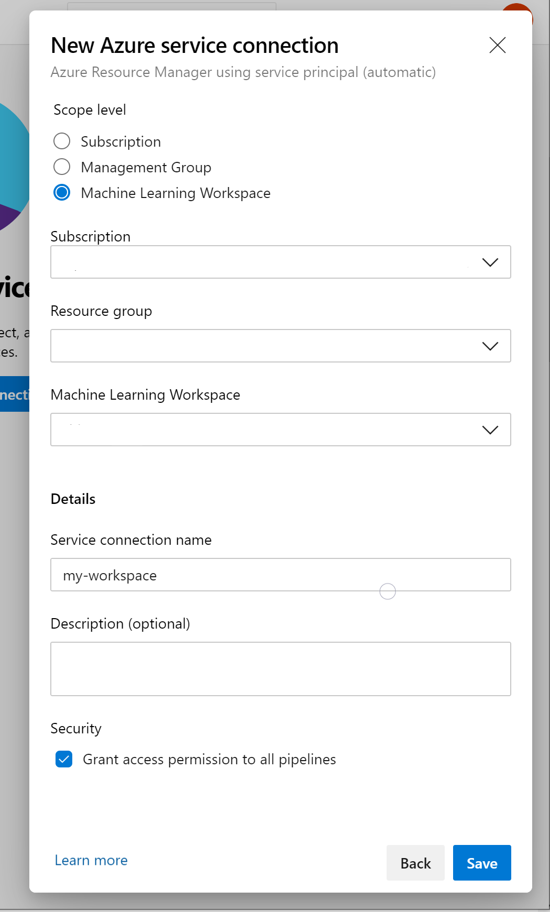
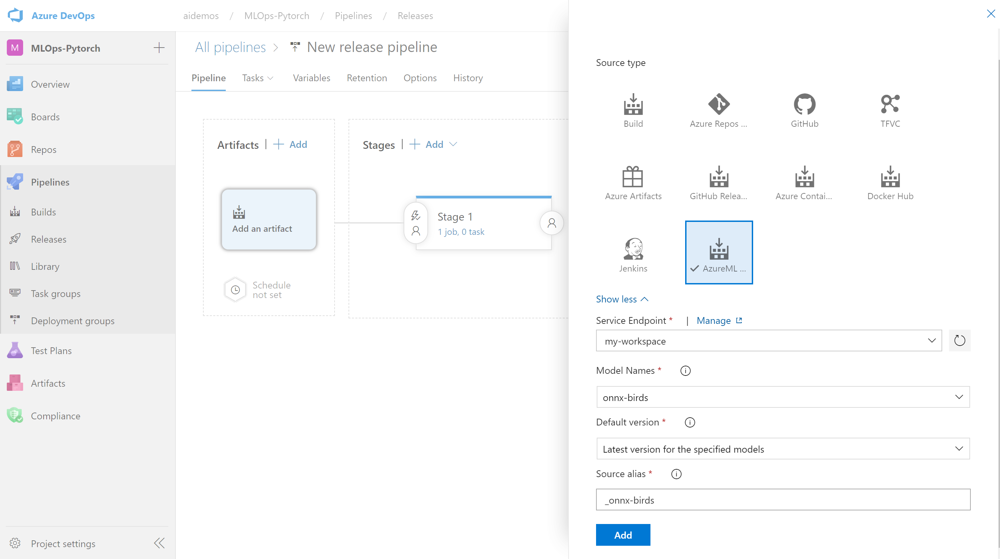
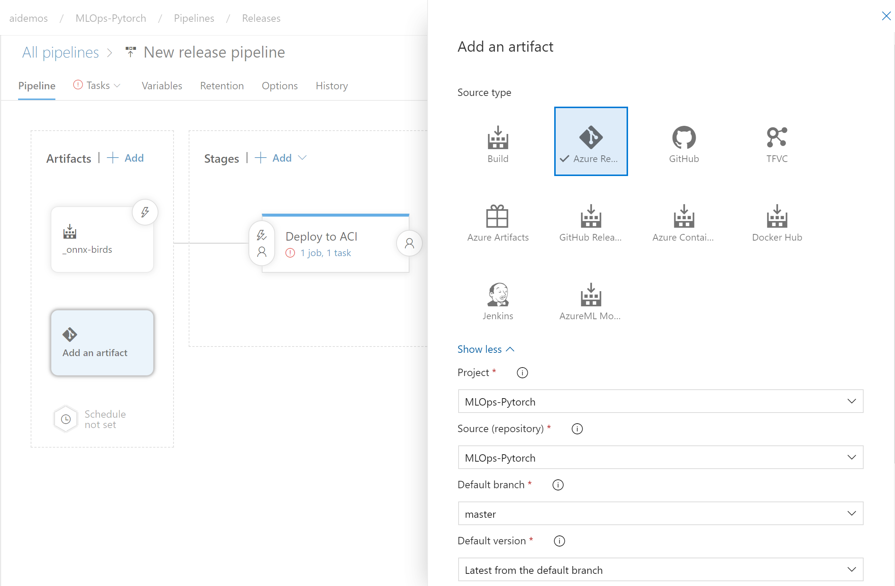
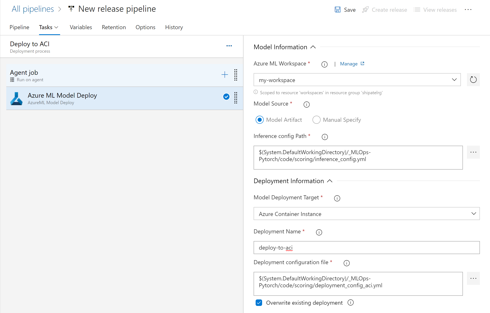
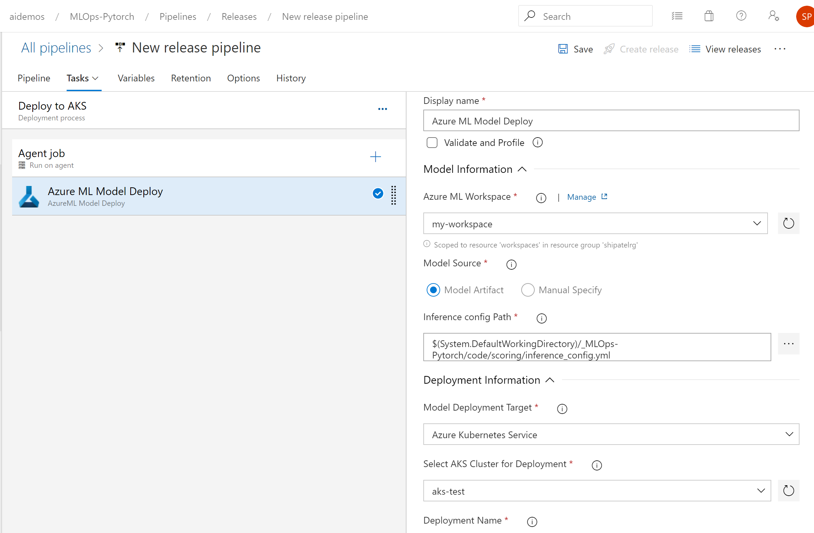
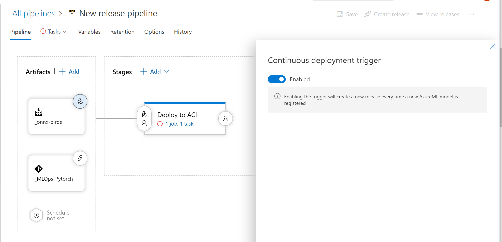
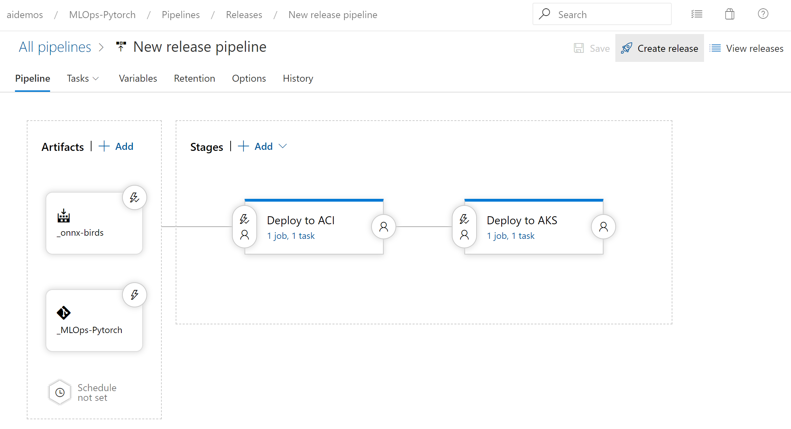

# Train and Deploy with Azure Machine Learning and Azure DevOps

In this simple example you will learn how to: 
1. Train an image classification model using pytorch
1. Perform hyperparameter tuning 
1. Convert a pytorch model to ONNX 
1. Create a release pipeline that gets triggered by a new ONNX model

For additional MLOps examples check out aka.ms/mlops

## Preqrequisites 

Before you begin, make sure you have the following:
* [Azure Machine Learning workspace](https://docs.microsoft.com/en-us/azure/machine-learning/service/how-to-manage-workspace)
* [Azure DevOps account](https://azure.microsoft.com/en-us/services/devops/)
* Completed the train-with-pytorch notebook in this repository to create a model 
* Clone this repo in your Azure DevOps project 

## Set up a Release Deployment Pipeline to Deploy the Model

The final step is to deploy the model across environments with a release
pipeline. There will be a **``QA``** environment running on
[Azure Container Instances](https://azure.microsoft.com/en-us/services/container-instances/)
and a **``Prod``** environment running on
[Azure Kubernetes Service](https://azure.microsoft.com/en-us/services/kubernetes-service).
This is the final picture of what your release pipeline should look like:

The pipeline consumes two artifacts:

1. The code source repo as it contains configuration files
1. The **onnx model** registered in your workspace

Install the **Azure Machine Learning** extension to your organization from the
[marketplace](https://marketplace.visualstudio.com/items?itemName=ms-air-aiagility.vss-services-azureml),
so that you can set up a service connection to your AML workspace.

To configure a model artifact, there should be a service connection to
 workspace you used in the training notebook. To get there, go to the project settings (by
clicking on the cog wheel to the bottom left of the screen), and then click on
**Service connections** under the **Pipelines** section:

**Note:** Creating service connection using Azure Machine Learning extension
requires 'Owner' or 'User Access Administrator' permissions on the Workspace.

Add a model artifact to the pipeline and select **AzureML Model Artifact** source
type. Select the **Project** and **Source (repository)** to ensure your pipeline has access to the configuration files for deployment.

Add an Azure repo artifact to the pipeline and select **Azure repo** source
type. Select the **Service Endpoint** and **Model Names** from the drop down
lists. **Service Endpoint** refers to the **Service connection** created in
the previous step:

Go to the new **Releases Pipelines** section, and click new to create a new
release pipeline. A first stage is automatically created and choose
**start with an Empty job**. Name the stage **QA (ACI)** and add a single task
to the job **Azure ML Model Deploy**. Make sure that the Agent Specification
is ubuntu-16.04 under the Agent Job. Specify task parameters as it is shown in the image below below:

In a similar way, create a stage **Prod (AKS)** and add a single task to the job
**Azure ML Model Deploy**. Make sure that the Agent Specification is
ubuntu-16.04 under the Agent Job. Specify task parameters as it is shown in the image below:

**Note:** Creating of a Kubernetes cluster on AKS is out of scope of this
tutorial, but you can find set up information in the docs
[here](https://docs.microsoft.com/en-us/azure/aks/kubernetes-walkthrough-portal#create-an-aks-cluster).

Similarly to the **Invoke Training Pipeline** release pipeline, previously
created, in order to trigger a coutinuous integration, click on the lightning
bolt icon, make sure the **Continuous deployment trigger** is checked and
save the trigger:

Congratulations! You have set up a release pipeline that deploys a model to QA (ACI) and Prod (AKS)
environments.

In order to trigger the deployment, run through the training process again or you can create a manual release as shown below. 

