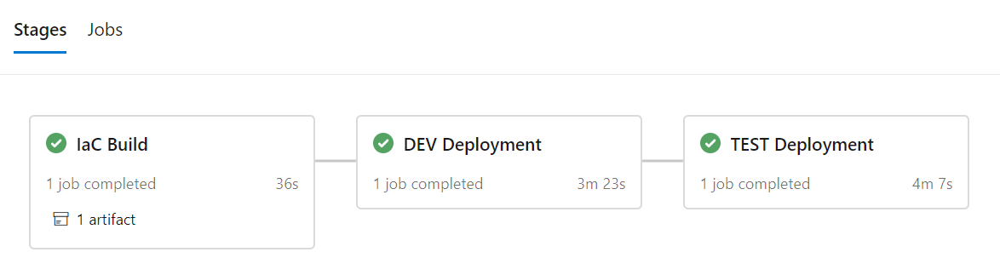

# Infrastructure as Code

This folder contains examples for how to bootstrap your machine learning workflow.
Azure Resource Manager (ARM) templates & Azure ML CLI commands can easily be used to bootstrap and provision workspaces for your data scientists prior to enabling them to begin data preparation & model training.

* **[ARM-Templates](arm-templates)** contains infrastructure-as-code templates and parameter files for two sample environments (dev + test). The use of ARM templates gives you the most flexibility in customizing your Azure resources.
* **[Scripts](scripts)** contains Azure CLI scripts for resource deployment. The use of CLI commands for deployment provides the most lean way to deploy resources to Azure.
* **[Build-and-Release](build-and-release)** contains pipeline definitions for Azure DevOps to automate infrastructure roll out. Included moreover is a PowerShell script that can be used for test deployments of the infrastructure resources.

## Automated roll out of infrastructure

In this section you will learn about how you could use [Azure Pipelines](https://azure.microsoft.com/en-us/services/devops/pipelines/) for the automated deployment of infrastructure. This way of working enables you to incrementally deploy changes to your resources, stage the changes over different environments, and build confidence as your system growths more complex.

### Getting started

Complete the below steps to set up your pipeline for infrastructure roll out.

* Navigate to [Azure DevOps](http://dev.azure.com/) and create a new organization and project. You can also re-use an existing organization and/or project.
* Create a new [service connection](https://docs.microsoft.com/en-us/azure/devops/pipelines/library/service-endpoints?view=azure-devops&tabs=yaml) in Azure DevOps of the Azure Resources Manager connection type. Azure DevOps will authenticate using this connection to make deployments to your Azure Subscription.
* In [deploy-infra.yml](build-and-release/deploy-infra.yml) replace `<your-service-connection-name>` by the name of the service connection that you created in the previous step.
* Some Azure resources require you to use globally unique names across Azure. This holds for example for storage account resources. Adapt resource names in the ARM parameter files to a name that is globally unique. Note that you should update the parameter files for the ML workspace and ML compute resources as well once you update the names of the underlying resources.
* Make a test deployment using the provided powershell script `deploy-infra.ps1`.
* Set up a new pipeline in Azure DevOps with the option to re-use an existing template. Point to the pipeline definition [deploy-infra.yml](build-and-release/deploy-infra.yml) in your repository.
* Run your pipeline from Azure DevOps. On completion, you should see a result like the below.

### Best practices on customizing the templates for your environment and team

* Many teams already have existing resources in their Azure tenant for e.g. Keyvault and Application Insights. These resources can be re-used by Azure Machine Learning. Simply point to these resources in the [Machine Learning Workspace template](arm-templates/mlworkspace/template.json). For ease of modification, we have provided separate templates for each of the resources in this repository.
* In most situations data already resides on existing storage in Azure. The [Azure CLI ML Extension](https://docs.microsoft.com/en-us/azure/machine-learning/reference-azure-machine-learning-cli) allows for a lean way to add storage as a [Datastore](https://docs.microsoft.com/en-us/azure/machine-learning/concept-data) in Azure Machine Learning. The [Azure CLI task](https://docs.microsoft.com/en-us/azure/devops/pipelines/tasks/deploy/azure-cli?view=azure-devops) in Azure DevOps can help you to automate the datastore attachment process as part of the infrastructure roll out.  
* Many teams choose to deploy multiple environments to work with, for example DEV, INT and PROD. In this way infrastructure can be rolled out in a phased way and with more confidence as your system becomes more complex.
* As one rolls out additional infrastructural resources, it becomes valuable to stage changes across the different environments. You could consider to run a set of integration or component tests before rolling out to PRD.
* It is a sound practice to protect the roll out of changes to PRD from originating from branches other than master. [Conditions](https://docs.microsoft.com/en-us/azure/devops/pipelines/process/conditions?view=azure-devops&tabs=yaml) in Azure pipelines can you help to set controls like these.
* One could specify a security group of users that require to give their [approval](https://docs.microsoft.com/en-us/azure/devops/pipelines/process/approvals?view=azure-devops&tabs=check-pass#approvals) to make roll outs to specific environments.
* It is important to note that in the MLOps way of working, we make a separation of concerns between the roll out of infrastructure and the roll out of ML artifacts. Hence the two types are rolled out at different moments and with different automation pipelines.
* Multiple additional security controls (virtual network rules, role-based access control and custom identities) can be applied on the Azure resources that are found in this repository. Controls can be added directly from the ARM templates. Consult the [documentation](https://docs.microsoft.com/en-us/azure/templates/) on Azure Resource Manager to find the possible modifications that can be made to each Azure Resource. As an example on modifications for the template for Azure ML compute, one can find a [template](arm-templates/mlcompute/template-vnet.json) in this repository that adds a SSH user and virtual network controls to the managed compute virtual machines.